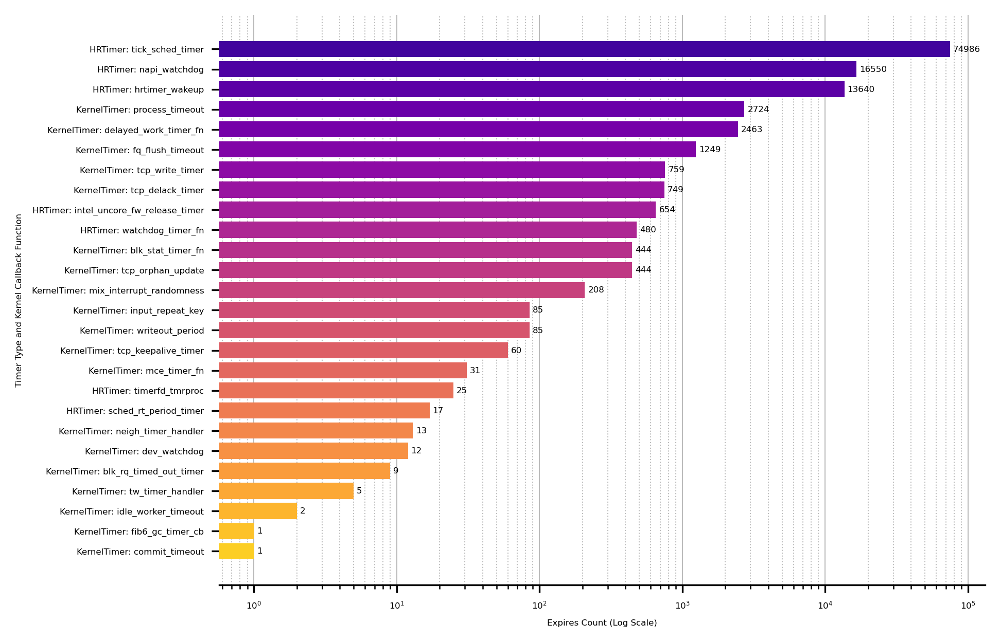
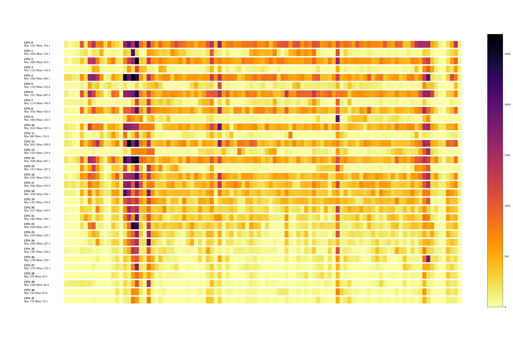
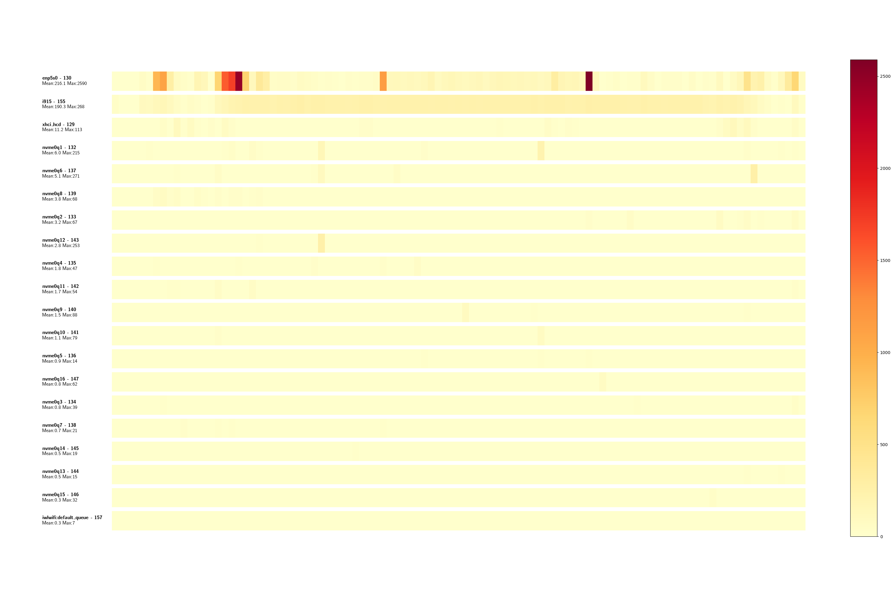
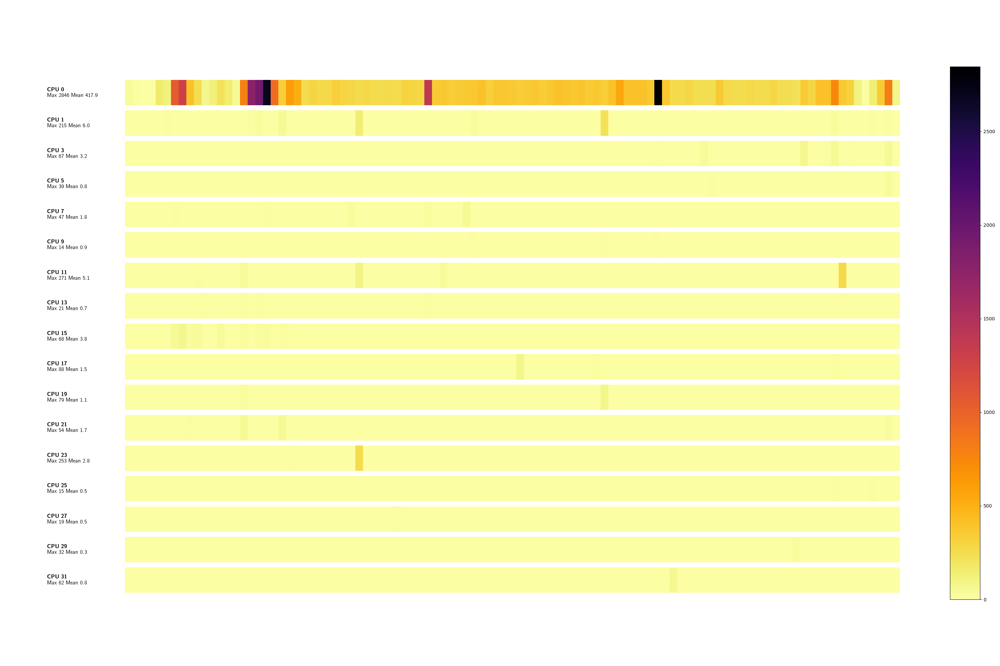

# Perf Power Statistics Module Documentation

The perf power statistic script try to fill the gap between applications like
powertop who provides high level insights about power management crucial
characteristics and time consuming manual analysis with a high degree on expert
knowledge.

*This documentation try to explain the functionality of the perf power
statistic script, the outputed data and how the data can be interpreted to help
the reader to do their own power management analysis. Furthermore, this
documentation provides a lot of post-processing scripts to further analyse the
data provided by the kernel and the perf power statistics script.*

## General Information

Perf power-statistics provide the functionality via so called modules. Each
module focus on one particular analyze and can be called separately. 

**Suppord modules are:**

- idle-cluster
- task
- timer
- frequency
- summary
- all (not a real module, it just enabling all other modules)

Based on this, each module often output several different analysis. For
example, the timer module provide information about timer type-callback
characteristics as well as time series of all expired timers. These different
outputs are called `analyzer`.

### Recording

Recording can be done be the provided perf wrapper to collect all required
events. The provided wrapper is just a handy shortcut to test everything.
Because power-management do so many different analyses a bunch of events are
required. This quickly leads to huge amounts of recorded data. For longer and
specific analyses, e.g. when using one module, it is beneficial to record just
the required events.

In the documentation of each module the required events are listed. This helps
to reduce the recorded events to a minimum.

> **Note:** power-analyzer are written in a robust way, if events are missing
> for a particular module it will just not work and output anything.


### Extended Output

Standard output for the modules focus on readability and the outputed
information can be processes by a human. Some modules provides more insights,
more raw values. This provided data must be forwarded into post-processing
chains (see next section). The output of these `analyzer` is prevented by
default. To enable additional analyzer, the option `--extended` is available.

> **Note**: extended do not extend the data by adding additional columns to the
> data. Extending means additional analyzer are enabled.

### Post-Processing

power-statistics is written in a way that the collected data can be post
processed by other tools as well. Data will then be read from Python for
Visualization with matplotlib, forecaster like sktime or other tools. For this
power-statistics was designed that all data can be reliable and easily
processed.

One important option that all modules implement is `--file-out`. If enabled,
all output is written in dedicated files, named like the particular analyzer,
e.g. `timer-type-callback-expiration.txt`.

These files are *guaranteed* parseable and CSV format, but the delimiter is not
a comma or semicolon, it is just whitespaces. So to read the data it is easy as
`pd.read_csv(FILE_PATH, delim_whitespace=True)` (pandas dataframe).


### CPU Filtering


Via `-C <n>` or `--cpu <n>` it is possible to restrict the output to one CPU.
However, it is important to note that not all commands understand this option.
The often better alternative is to specify a CPU when recording, if this is
possible, for example because processes have been pinned to a specific CPU with
taskset.

```
perf script power-statistics.py -- --mode wakeups-timesequence -C 1
```

Sometimes the option is even dangerous. For example, in the timer analysis
due to task migrations, recurring timer may be moved from one CPU to another.
If the filtering limits the analysis of a particular timer then the analyzation
will not see the `hrtimer_init` event.

Each module has independend requirements if CPU filtering is risky or if even
required. This will be elucidate in the description of each module.

### General Usage


perf power-statistics provides several modules, they can be queried via

```
$ perf script -i /tmp/perf.out -s ~/src/code/linux/tools/perf/scripts/python/power-statistics.py -- --mode help
usage: power-statistics.py [-h] [-m [{idle-cluster,task,timer,frequency,summary,all}]] [-C CPU] [-v] [--highlight-tasks HIGHLIGHT_TASKS] [--stdio-color {always,never,auto}] [--csv]
power-statistics.py: error: argument -m/--mode: invalid choice: 'help' (choose from 'idle-cluster', 'task', 'timer', 'frequency', 'summary', 'all')
```


Subsequent sections describe all modules in detail and how to post-process the data

## General Aspects

## Recording

## CPU Filtering

# Timer (mode: timer)

*Required events: ...*


The recorded data length is 60 seconds. The first 20 seconds is on a nearly
idle Gnome desktop system. After 20 seconds chromium is started and a bunch of
website are visited, this for again 20 seconds. Afterwards, no further browser
interaction are done - the system slowly calms down.

## Timer Expire

Output Data (`timer-expires.txt`):

```
Time     PID             Comm CPU   TimerType              Now  StartSoftExpire      StartExpire Function
286620.187660809  152123  ThreadPoolForeg  11     HRTimer  286629470151692  286629470099466  286629470149466 hrtimer_wakeup
286620.188537133  152124  ThreadPoolForeg   4     HRTimer  286629471022978  286629470919418  286629470969418 hrtimer_wakeup
286620.193581325      -1          unknown  10     HRTimer  286629476066745  286629476000000  286629476000000 tick_sched_timer
286620.193599137      -1          unknown  10 KernelTimer       4366549652       4366549651       4366549651 blk_stat_timer_fn
286620.197588773      -1          unknown   9     HRTimer  286629480072777  286629480000000  286629480000000 tick_sched_timer
286620.197606219      -1          unknown   9 KernelTimer       4366549653       4366549652       4366549652 delayed_work_timer_fn
286620.201196138   86127            kitty  27     HRTimer  286629483678969  286629483543653  286629483593653 hrtimer_wakeup
286620.215074830  150947            sleep   4     HRTimer  286629497561008  286629497454283  286629497504283 hrtimer_wakeup
286620.217582137      -1          unknown  23     HRTimer  286629500067923  286629500000000  286629500000000 tick_sched_timer
[...]
```

The most obvious analysis is the number of expired timers, i.e. timers that
have not been stopped prematurely, but which have actually expired and will
trigger an action. The following illustration shows all expired timers of all
CPUs and summarises them at process level. As a large number of processes
trigger a timer during 100 seconds or recording, the visualisation script has a
limit that can be set so that processes with fewer expired timers are not
displayed; this limit is set here at 400.


The large number of timers in the unknown process is eye-catching. This unknown
class contains timers that were started by the kernel and/or where no
assignment to a userspace process is possible.

The next image illustrate the same data but with a logarithmic scale for
y-axis. The following picture becomes immediately apparent: many Chromium-based
processes become executable after 20 seconds. You can also see that Kitty (GPU
based terminal emulator) causes a constant timer load per terminal, two
terminals are executed.


The use of a logarithmic scale makes more data visible and is advantageous for
many analyses.


## Timer Type Callback Expiration

Output Format:

```
TimerType      Callback         Expires 
HRTimer        ffffffffb6da37c0 34051 
HRTimer        ffffffffb6d8d650 6468 
HRTimer        ffffffffb75615e0 4040 
HRTimer        ffffffffb6de6a80 800 
HRTimer        ffffffffc0b0cd20 413 
HRTimer        ffffffffb6d9f280 1 
KernelTimer    ffffffffb6cddab0 2647 
KernelTimer    ffffffffb6d8b610 1629 
KernelTimer    ffffffffb743fb50 745 
KernelTimer    ffffffffb718bfc0 415 
[...]
```

> **Tip:** see Appendix (Kernel Address to Kernel Function Name Mapping) to map
> these addresses to kernel function names.





# Wakeups Timesequence (mode: wakeups-timesequence)

*Required events: sched_switch*

Show on a per process and thread basis the wakeups for every second. This
analyse can be used to get an idea about periods where a process triggers many
wakeups vs. periods of a task where only a few wakeups are triggered.

These data can be used to visualize the data to provide a human overview.

> **Note:** process wakeups are not the only way to wake up a CPU core from a sleep
> phase. Interrupts also lead to a change to a C0 status. But: the analysis at
> process/thread level allows the easiest intervention, as the execution
> control is in the hands of the developer - this is not the case with IRQs
> that occur asynchronously. 


## Wakeup Task per CPU View

The following picture shows a nearly idle system, only a wild process, which is
always migrated to different cores by the scheduler, generates a constantly
high wakeup load.



## Wakeup Task View

The following illustration show the exact same data, but with a  focus on a
task level. Here the former crazy task - a clipboard process gone wild - which
asks for clipboard data much too eagerly, causes a high wakeup load.


## Wakeup IRQ View



## Wakeup IRQ per CPU View




# Appendix

# Kernel Address to Kernel Function Name Mapping

Some analysis benefits from providing the function name instead of illustrating
the raw kernel address. For example: in the timer analysis the internal
callback functions are recorded. But addresses like `ffffffffb6da37c0` are not
that helpful for the user. To map these kernel addresses to function names a
generic mapping script is provided in the assets directory. This script simple
iterates over *stdout* replaces all matches with the function name - here
`tick_sched_timer`- and print out everything else untouched to stdout. 

## Usage

```
# read from STDIN and pipe to STDOUT
$ sudo assets/kallsyms-mapper.py <timer-type-callback-expiration-bar.txt >tmp.txt
$ mv tmp.txt timer-type-callback-expiration-bar.txt
```

If the script is not executed with effective UID 0 a warning is printed on stderr.

> **Note:** the replacement must be done on the recording systems to recording
> time. Especially on systems with activated Kernel Address Space Layout
> Randomization (KASLR) where positions of kernel code is pseudo-randomized at
> boot time.
