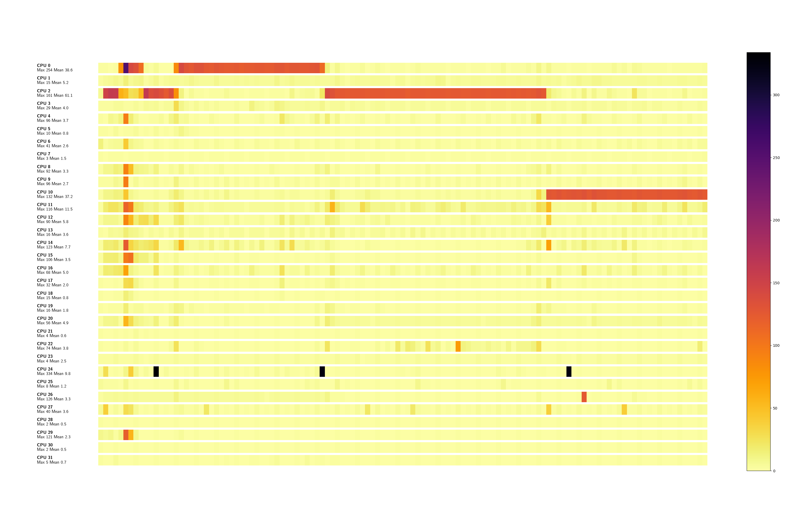
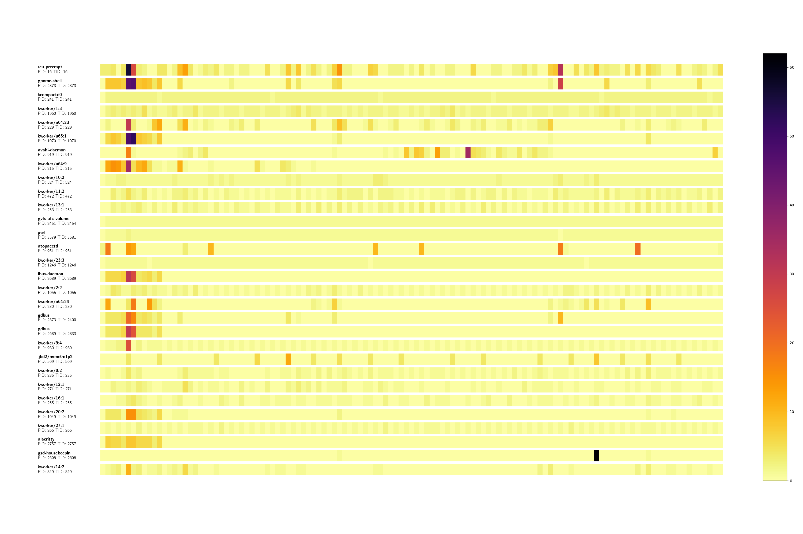

# Perf Power Statistics Module Documentation

perf power-statistics provides several modules, they can be queried via

```
$ perf script -i /tmp/perf.out -s ~/src/code/linux/tools/perf/scripts/python/power-statistics.py -- --mode help
usage: power-statistics.py [-h] [-m [{idle-cluster,task,timer,frequency,summary,all}]] [-C CPU] [-v] [--highlight-tasks HIGHLIGHT_TASKS] [--stdio-color {always,never,auto}] [--csv]
power-statistics.py: error: argument -m/--mode: invalid choice: 'help' (choose from 'idle-cluster', 'task', 'timer', 'frequency', 'summary', 'all')
```

Suppord modules are

- idle-cluster
- task
- timer
- frequency
- summary
- all


The following sections describe all modules in detail and how to post-process the data

# Wakeups Timesequence (mode: wakeups-timesequence)

*Required events: sched_switch*

Show on a per prozess and thread basis the wakeups for every second. This
analyse can be used to get an idea about periods where a process triggers many
wakeups vs. periods of a task where only a few wakeups are triggered.

These data can be used to visualize the data to provide a human overview.

## General Aspects

## Recording

## CPU Filtering

Via -C <n> or --cpu <n> it is possible to beschränken auf eine CPU. Wichtig ist aber das nicht alle Kommandos diese Option verstehen.
Die oft bessere Alternative ist es aber bereits bei der Aufzeichnung sich auf
eine CPU festzulegen, falls dies Möglich ist, beispielsweise weil Prozesse mit
taskset auf eine bestimme CPU ge-pinned wurden.

```
perf script -i /tmp/perf.out -s ~/src/code/linux/tools/perf/scripts/python/power-statistics.py -- --mode wakeups-timesequence -C 1
```


## CPU View



## Task View



