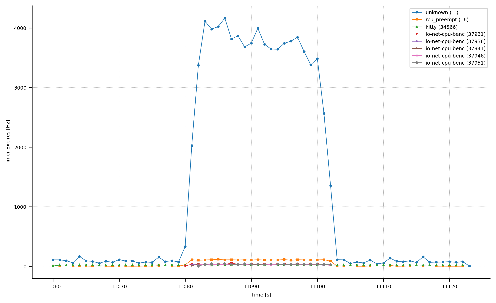
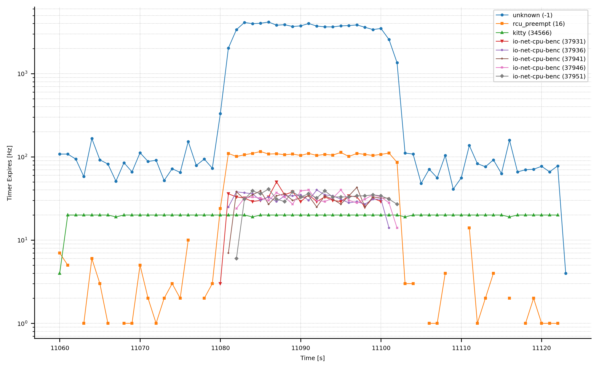
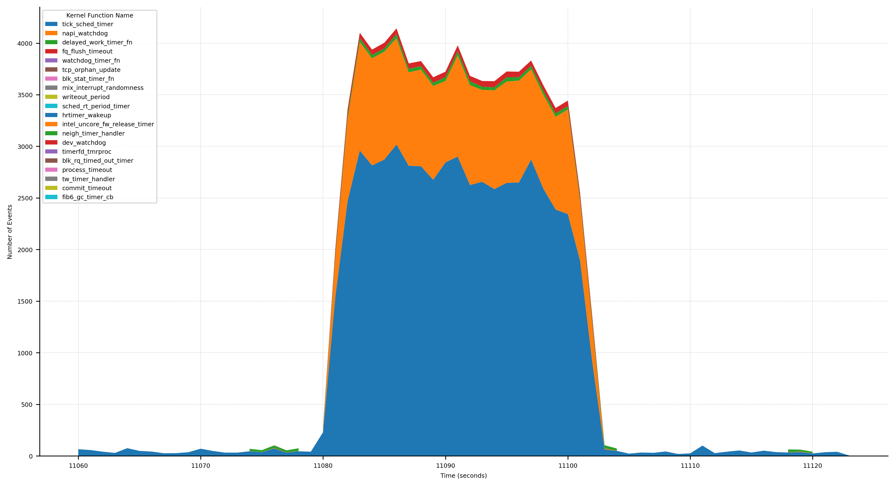
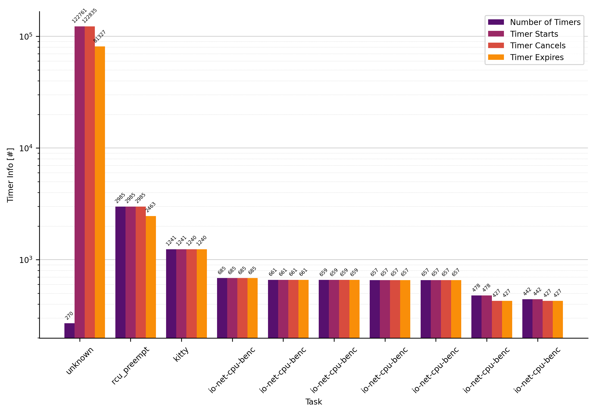
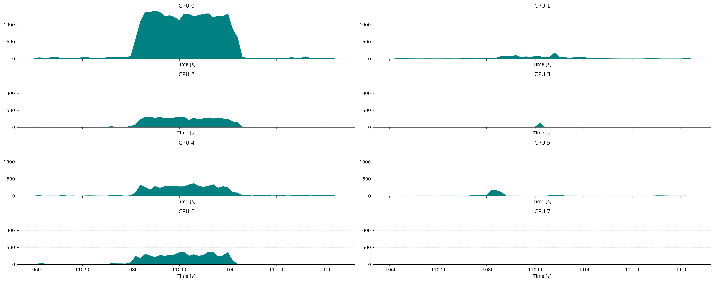
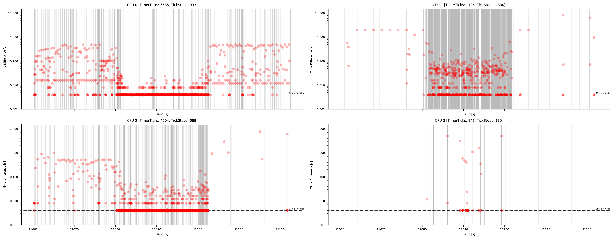
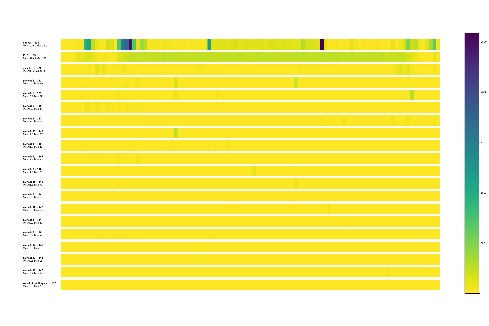
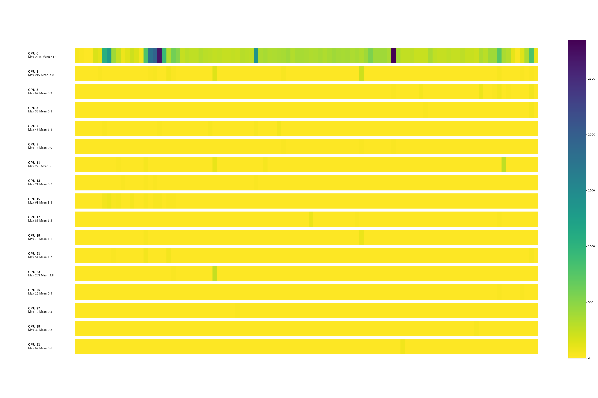

# Perf Power Statistics Module Documentation

The perf power statistic script try to fill the gap between applications like
powertop who provides high level insights about power management crucial
characteristics and complete manual analysis of power relevant subsystems with
the goal to optimize whole systems.

This perf script extract the most relevant Power Management data from the
kernel and present it in a module-specific and understandable form.
Additionally, the data created is explicitly designed to be passed on to
specialized analysis scripts in order to obtain more detailed and graphical
analyses. Nevertheless, many modules already provide a very detailed insight,
just by looking at them, without you having to go any deeper.

Many analyses at this level require a deep understanding of the Linux Kernel
and its processes - unfortunately, the script cannot compensate for this.

*This documentation try to explain the functionality of the perf power
statistic script, the outputed data and how the data can be interpreted to help
the reader to do their own power management analysis. Furthermore, this
documentation provides a lot of post-processing scripts to further analyse the
data provided by the kernel and the perf power statistics script. To generate
these charts for your particular use cases, often just two commands are
required.*

## General Information

Perf power-statistics provide the functionality via so called modules. Each
module focus on one particular analyze and can be called separately. 

**Suppord modules are:**

- idle-cluster
- task
- timer
- frequency
- summary
- all (not a real module, it just enabling all other modules)

Based on this, each module often output several different analysis. For
example, the timer module provide information about timer type-callback
characteristics as well as time series of all expired timers. These different
outputs are called `analyzer`.

### Recording

Recording can be done be the provided perf wrapper to collect all required
events. The provided wrapper is just a handy shortcut to test everything.
Because power-management do so many different analyses a bunch of events are
required. This quickly leads to huge amounts of recorded data. For longer and
specific analyses, e.g. when using one module, it is beneficial to record just
the required events.

In the documentation of each module the required events are listed. This helps
to reduce the recorded events to a minimum.

> **Note:** power-analyzer are written in a robust way, if events are missing
> for a particular module it will just not work and output anything.


### Extended Output

Standard output for the modules focus on readability and the outputed
information can be processes by a human. Some modules provides more insights,
more raw values. This provided data must be forwarded into post-processing
chains (see next section). The output of these `analyzer` is prevented by
default. To enable additional analyzer, the option `--extended` is available.

> **Note**: extended do not extend the data by adding additional columns to the
> data. Extending means additional analyzer are enabled.

### Post-Processing

power-statistics is written in a way that the collected data can be post
processed by other tools as well. Data will then be read from Python for
Visualization with matplotlib, forecaster like sktime or other tools. For this
power-statistics was designed that all data can be reliable and easily
processed.

One important option that all modules implement is `--file-out`. If enabled,
all output is written in dedicated files, named like the particular analyzer,
e.g. `timer-type-callback-expiration.txt`.

These files are *guaranteed* parseable and CSV valid. So it number of column do
not change depending on the data. In contrast to CSV the delimiter is not a
comma or semicolon, it is just whitespaces. So to read the data it is easy as
`pd.read_csv(FILE_PATH, delim_whitespace=True)` (pandas dataframe).

The files, generated by `--file-out` begin with the name of the module. So for
example, the timer module generates some analysis, so that the files are always
pre-fixed with timer-...: write data to timer-.. `timer-task-info.txt`,
`timer-type-callback-expiration.txt` and `timer-expires.txt`


### CPU Filtering


Via `-C <n>` or `--cpu <n>` it is possible to restrict the output to one CPU.
However, it is important to note that not all commands understand this option.
The often better alternative is to specify a CPU when recording, if this is
possible, for example because processes have been pinned to a specific CPU with
taskset.

```
perf script power-statistics.py -- --mode wakeups-timesequence -C 1
```

Sometimes the option is even dangerous. For example, in the timer analysis
due to task migrations, recurring timer may be moved from one CPU to another.
If the filtering limits the analysis of a particular timer then the analyzation
will not see the `hrtimer_init` event.

Each module has independend requirements if CPU filtering is risky or if even
required. This will be elucidate in the description of each module.

### General Usage


perf power-statistics provides several modules, they can be queried via

```
$ perf script -i /tmp/perf.out -s ~/src/code/linux/tools/perf/scripts/python/power-statistics.py -- --mode help
usage: power-statistics.py [-h] [-m [{idle-cluster,task,timer,frequency,summary,all}]] [-C CPU] [-v] [--highlight-tasks HIGHLIGHT_TASKS] [--stdio-color {always,never,auto}] [--csv]
power-statistics.py: error: argument -m/--mode: invalid choice: 'help' (choose from 'idle-cluster', 'task', 'timer', 'frequency', 'summary', 'all')
```


Subsequent sections describe all modules in detail and how to post-process the data

## General Aspects

## Recording

## CPU Filtering

# Timer (mode: timer)

*Required events: ...*


The recorded data length is 60 seconds. The first 20 seconds is on a nearly
idle Gnome desktop system. After 20 seconds chromium is started and a bunch of
website are visited, this for again 20 seconds. Afterwards, no further browser
interaction are done - the system slowly calms down.

## Timer Expire

- Output Filename: `timer-expires.txt`
- Required Evemts
 - timer:hrtimer_init
 - timer:hrtimer_start
 - timer:hrtimer_expire_entry
 - timer:hrtimer_cancel
 - timer:timer_init
 - timer:timer_start
 - timer:timer_expire_entry
 - timer:timer_cancel
- Extended Mode (`--extended`)

Output Data:

```
            Time     PID             Comm CPU   TimerType              Now  StartSoftExpire      StartExpire Function
286620.187660809  152123  ThreadPoolForeg  11     HRTimer  286629470151692  286629470099466  286629470149466 hrtimer_wakeup
286620.188537133  152124  ThreadPoolForeg   4     HRTimer  286629471022978  286629470919418  286629470969418 hrtimer_wakeup
286620.193581325      -1          unknown  10     HRTimer  286629476066745  286629476000000  286629476000000 tick_sched_timer
286620.193599137      -1          unknown  10 KernelTimer       4366549652       4366549651       4366549651 blk_stat_timer_fn
286620.197588773      -1          unknown   9     HRTimer  286629480072777  286629480000000  286629480000000 tick_sched_timer
286620.197606219      -1          unknown   9 KernelTimer       4366549653       4366549652       4366549652 delayed_work_timer_fn
286620.201196138   86127            kitty  27     HRTimer  286629483678969  286629483543653  286629483593653 hrtimer_wakeup
286620.215074830  150947            sleep   4     HRTimer  286629497561008  286629497454283  286629497504283 hrtimer_wakeup
286620.217582137      -1          unknown  23     HRTimer  286629500067923  286629500000000  286629500000000 tick_sched_timer
[...]
```

The most obvious analysis is the number of expired timers, i.e. timers that
have not been stopped prematurely, but which have actually expired and will
trigger an action. The following illustration shows all expired timers of all
CPUs and summarises them at process level. As a large number of processes
trigger a timer during 100 seconds or recording, the visualisation script has a
limit that can be set so that processes with fewer expired timers are not
displayed; this limit is set here at 400.




The large number of timers in the unknown process is eye-catching. This unknown
class contains timers that were started by the kernel and/or where no
assignment to a userspace process is possible.

The next image illustrate the same data but with a logarithmic scale for
y-axis. The following picture becomes immediately apparent: many Chromium-based
processes become executable after 20 seconds. You can also see that Kitty (GPU
based terminal emulator) causes a constant timer load per terminal, two
terminals are executed.



The use of a logarithmic scale makes more data visible and is advantageous for
many analyses.

Now let's zoom into the "unknown" area. So kernel-specific timers and break
this down. What are the different timers for, what do they do? For this
analysis it is necessary that kallsyms-mapper.py (see appendix) was called to
exchange kernel addresses for the function name. For the analysis we use a
stack graph, the number of timers per second is accumulated. 



The following is nice to see:

- at second 20, the timer ticks increase massively. These are by far the most
  frequent source of executed timers. Also easy to recognise. The kernel is
  configured with 250Hz, i.e. a maximum of 250 timers can strike per core
  (multiplied by the number of cores, we get the maximum timer ticks per second
  for the entire system). In the first 20 seconds you can also see very clearly
  that `CONFIG_NO_HZ_FULL`
- large number of network stack relevant timers can be recognised, especially
  NAPI handling and also TCP state machine relevant timers.
- remaining timer expires are common timers, triggered more often because of
  more overall processing.


> **Info:** even if we see a lot of timers here, this does not necessarily
> mean that this is the source of unfavourable power management behaviour. In
> periods of 20 seconds to 40 seconds the system is at 100% processing for some
> cores. Timers do not wake up the system or contribute negatively to power
> efficiency. Or in other words: long and deep sleep phases are not possible in
> the period from 20 to 40 seconds for capacity utilisation reasons.


## Timer Task Info

- Output Filename: `timer-task-info.txt`
- Required Evemts
 - timer:hrtimer_init
 - timer:hrtimer_start
 - timer:hrtimer_expire_entry
 - timer:hrtimer_cancel
 - timer:timer_init
 - timer:timer_start
 - timer:timer_expire_entry
 - timer:timer_cancel

Output Format:

```
            Comm      PID     Timers     Starts    Cancels    Expires Expires[Hz]  CPUs                
         unknown       -1        270     122761     122835      81327    1306.364  0,1,2,3,4,5,6,7,8,9,10,11,12,13,14,15,16,17,18,19,20,21,22,23,24,25,26,27,28,29,30,31
     rcu_preempt       16       2985       2985       2985       2463      39.563  0,1,2,4,6,8,10,12,14,16,17,18,19,20,24,25
           kitty    34566       1241       1241       1240       1240      19.918  6,8,16,18,20        
 io-net-cpu-benc    37951        685        685        685        685      11.003  0,2,4,6,8,10,12,14,16,17,18,19,20
 io-net-cpu-benc    37936        661        661        661        661      10.618  0,2,4,6,8,10,12,14,16,17,18,19
           gmain     2644      10045      10045      10045        240       3.855  0,22,23             
 io-net-cpu-benc    37947       2138       1554       1549        230       3.695  0,1,2,3,4,6,8,10,12,14
 io-net-cpu-benc    37937       2147       1576       1563        229       3.678  0,2,4,6,8,10,12,14,16
     gnome-shell     2404        843        837        830        143       2.297  0,2,4,6,8,9,10,12,14,16,17,20
           kitty     4204        684        684        683        134       2.152  0,2,4,6,8,10,12,14,16,17,18,19,20
      kcompactd0      247        122        122        121        121       1.944  0,2,4,6,8,10,16     
       atopacctd      999        106        106        105        105       1.687  26                  
            perf    37927         62         62         61         61       0.980  13                  
    avahi-daemon    23584        119        119        118         42       0.675  0,2,18,4            
      khungtaskd      244          1          1          0          0       0.000  17                  
         systemd        1          1          1          0          0       0.000  1                   
[...]
```



## Timer Task CPU

- Output Filename: `timer-task.txt`
- Required Evemts
 - timer:hrtimer_init
 - timer:hrtimer_expire_entry
 - timer:timer_init
 - timer:timer_expire_entry




Output Format:

```
            Comm      PID     Timers     Starts    Cancels    Expires Expires[Hz]  CPUs                
         unknown       -1        270     122761     122835      81327    1306.364  0,1,2,3,4,5,6,7,8,9,10,11,12,13,14,15,16,17,18,19,20,21,22,23,24,25,26,27,28,29,30,31
     rcu_preempt       16       2985       2985       2985       2463      39.563  0,1,2,4,6,8,10,12,14,16,17,18,19,20,24,25
           kitty    34566       1241       1241       1240       1240      19.918  6,8,16,18,20        
 io-net-cpu-benc    37951        685        685        685        685      11.003  0,2,4,6,8,10,12,14,16,17,18,19,20
 io-net-cpu-benc    37936        661        661        661        661      10.618  0,2,4,6,8,10,12,14,16,17,18,19
           gmain     2644      10045      10045      10045        240       3.855  0,22,23             
 io-net-cpu-benc    37947       2138       1554       1549        230       3.695  0,1,2,3,4,6,8,10,12,14
 io-net-cpu-benc    37937       2147       1576       1563        229       3.678  0,2,4,6,8,10,12,14,16
     gnome-shell     2404        843        837        830        143       2.297  0,2,4,6,8,9,10,12,14,16,17,20
           kitty     4204        684        684        683        134       2.152  0,2,4,6,8,10,12,14,16,17,18,19,20
      kcompactd0      247        122        122        121        121       1.944  0,2,4,6,8,10,16     
       atopacctd      999        106        106        105        105       1.687  26                  
            perf    37927         62         62         61         61       0.980  13                  
    avahi-daemon    23584        119        119        118         42       0.675  0,2,18,4            
      khungtaskd      244          1          1          0          0       0.000  17                  
         systemd        1          1          1          0          0       0.000  1                   
[...]
```


## Timer Type Callback Expiration

- Output Filename: `timer-type-callback-expiration.txt`
- Required Evemts
 - timer:hrtimer_init
 - timer:hrtimer_start
 - timer:hrtimer_expire_entry
 - timer:hrtimer_cancel
 - timer:timer_init
 - timer:timer_start
 - timer:timer_expire_entry
 - timer:timer_cancel

Output Format:

```
TimerType      Callback                      Expires
HRTimer        tick_sched_timer              57782
HRTimer        napi_watchdog                 19404
HRTimer        hrtimer_wakeup                10300
HRTimer        watchdog_timer_fn             504
HRTimer        sched_rt_period_timer         26
HRTimer        intel_uncore_fw_release_timer 20
HRTimer        timerfd_tmrproc               10
HRTimer        it_real_fn                    1
KernelTimer    process_timeout               2594
KernelTimer    delayed_work_timer_fn         1662
KernelTimer    fq_flush_timeout              1206
KernelTimer    tcp_write_timer               493
KernelTimer    tcp_orphan_update             350
KernelTimer    tcp_delack_timer              258
[...]
```

> **Tip:** see Appendix (Kernel Address to Kernel Function Name Mapping) to map
> these addresses to kernel function names.


## Timer Tick Info

- Output Filename: `timer-tick-info.png`
- Required Evemts
 - timer:hrtimer_expire_entry
 - timer:tick_stop

Output Format:

```
           Time  CPU           Event Success Dependency Kernel-Function
11060.263109719   25       TICK_STOP       1          0 None
11060.263174075    2    EXPIRE_ENTRY      -1       None tick_sched_timer
11060.263174239    8    EXPIRE_ENTRY      -1       None tick_sched_timer
11060.263182312   26       TICK_STOP       1          0 None
11060.267187041    0       TICK_STOP       1          0 None
11060.267187678    2    EXPIRE_ENTRY      -1       None process_timeout
11060.267189072   31    EXPIRE_ENTRY      -1       None tick_sched_timer
[...]
```




# Wakeups Timesequence (mode: wakeups-timesequence)

*Required events: sched_switch*

Show on a per process and thread basis the wakeups for every second. This
analyse can be used to get an idea about periods where a process triggers many
wakeups vs. periods of a task where only a few wakeups are triggered.

These data can be used to visualize the data to provide a human overview.

> **Note:** process wakeups are not the only way to wake up a CPU core from a sleep
> phase. Interrupts also lead to a change to a C0 status. But: the analysis at
> process/thread level allows the easiest intervention, as the execution
> control is in the hands of the developer - this is not the case with IRQs
> that occur asynchronously. 


## Wakeup Task per CPU View

The following picture shows a nearly idle system, only a wild process, which is
always migrated to different cores by the scheduler, generates a constantly
high wakeup load.


## Wakeup Task View

The following illustration show the exact same data, but with a  focus on a
task level. Here the former crazy task - a clipboard process gone wild - which
asks for clipboard data much too eagerly, causes a high wakeup load.


## Wakeup IRQ View



## Wakeup IRQ per CPU View




# Appendix

# Kernel Address to Kernel Function Name Mapping

Some analysis benefits from providing the function name instead of illustrating
the raw kernel address. For example: in the timer analysis the internal
callback functions are recorded. But addresses like `ffffffffb6da37c0` are not
that helpful for the user. To map these kernel addresses to function names a
generic mapping script is provided in the assets directory. This script simple
iterates over *stdout* replaces all matches with the function name - here
`tick_sched_timer`- and print out everything else untouched to stdout. 

## Usage

```
# read from STDIN and pipe to STDOUT
$ sudo assets/kallsyms-mapper.py <timer-type-callback-expiration-bar.txt >tmp.txt
$ mv tmp.txt timer-type-callback-expiration-bar.txt
```

If the script is not executed with effective UID 0 a warning is printed on stderr.

> **Note:** the replacement must be done on the recording systems to recording
> time. Especially on systems with activated Kernel Address Space Layout
> Randomization (KASLR) where positions of kernel code is pseudo-randomized at
> boot time.
